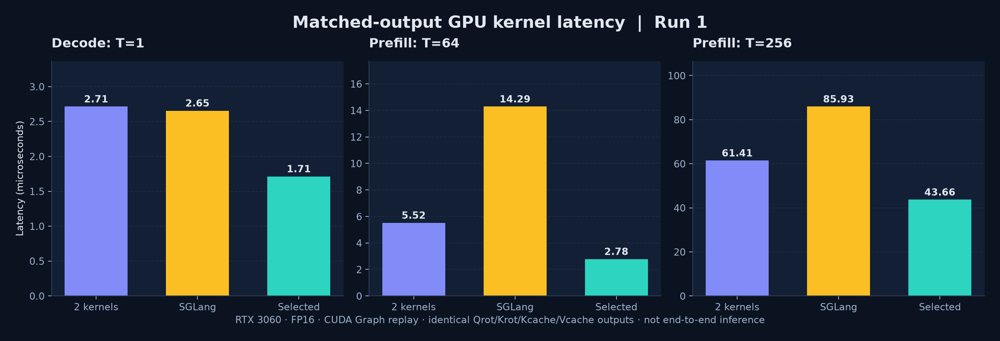
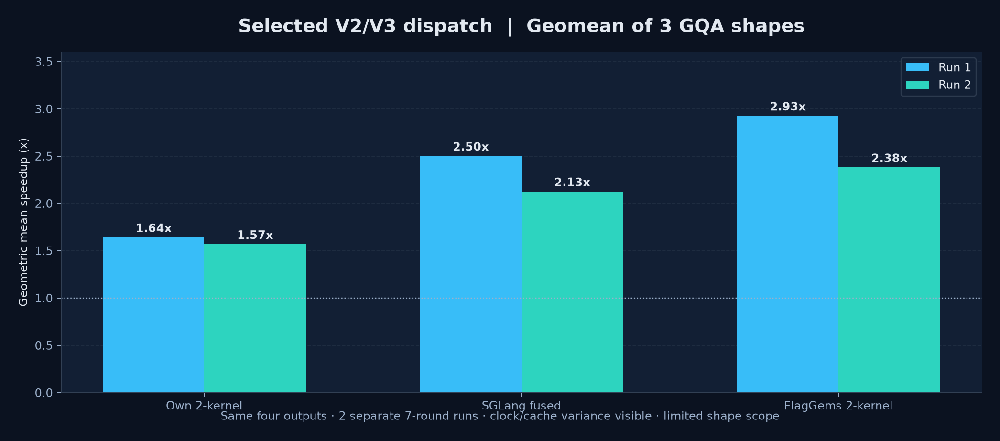
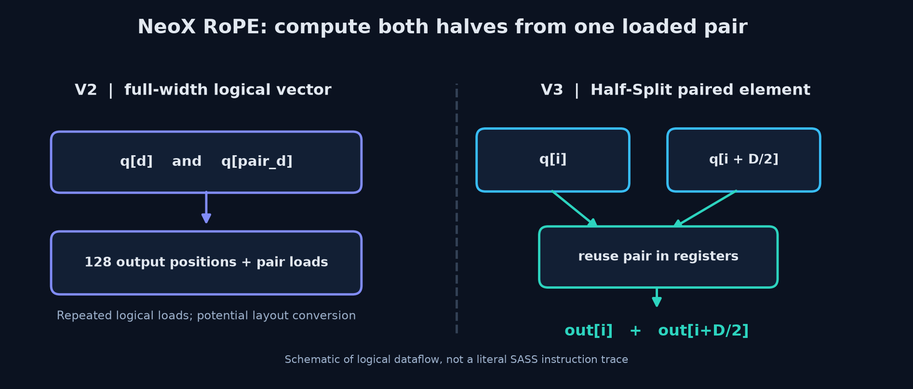
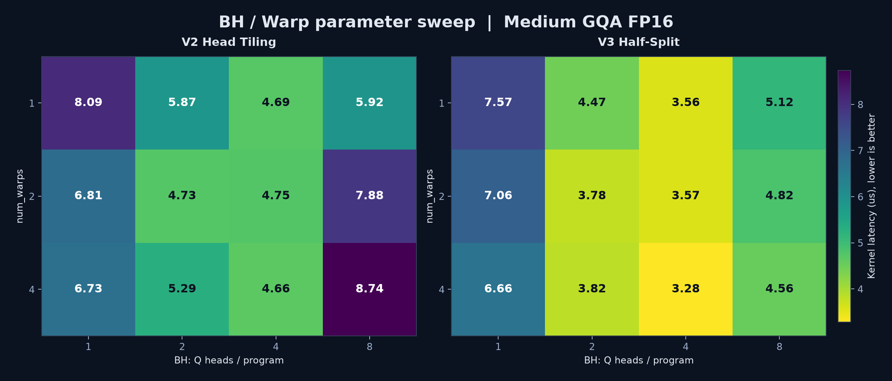
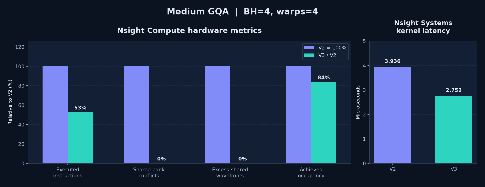
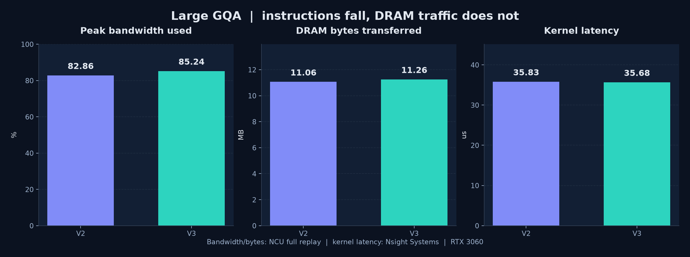

# Triton RoPE + Paged KV Cache: Kernel Fusion and Performance Engineering

[中文 README](README_zh.md) | [Benchmarks](results/) | [Nsight hardware analysis](docs/V2_V3_NCU_硬件计数器验证报告.md)

Independent Triton AI Infra project implementing fused full-dimensional NeoX Q/K rotary embeddings and paged K/V cache updates with GQA. Developed and measured on NVIDIA RTX 3060 12 GB (Windows, Python 3.12, PyTorch 2.4.0+cu121, Triton-Windows 3.3.1).

**Not** an upstream SGLang/vLLM PR, a production CUDA path replacement, or end-to-end LLM throughput benchmark.

## Optimization pipeline

1. **Kernel fusion:** RoPE and KV cache scatter executed in a single GPU kernel, removing an intermediate rotated K write-then-reload and a separate launch. For matched-output comparisons, the implementation ALSO writes an independent K_rot output, but never reloads that tensor to write the cache.
2. **V2 Head Tiling:** group BH query heads in one Triton program; share token-level cos/sin and tune BH plus warp count.
3. **V3 Half-Split:** load x[i] and x[i+D/2] into the same logical Triton element and reuse both values to calculate two NeoX outputs. This reduces redundant load instructions and many shared-memory layout conversions.
4. **Profiler-guided dispatch:** choose V3 for small/medium GQA and V2 for the tested large GQA shape; memory bandwidth becomes limiting at larger sizes.

## Latest matched-output performance (RTX 3060 / FP16)

All implementations write and validate **Q_rot, K_rot, K Cache and V Cache**. These numbers are per-GPU-kernel CUDA Graph microbenchmarks, not model tokens/s. Results show ranges over two independent 7-round interleaved runs.

| Input shape (T,QH,KVH,D) | Current choice | vs own two-kernel | vs SGLang saved fused Triton | vs extracted FlagGems two-kernel |
|---|---|---:|---:|---:|
| (1,32,8,128) | V3 BH1 / W4 | 1.32–1.58x | 1.28–1.55x | 4.31–5.09x |
| (64,32,8,128) | V3 BH4 / W4 | 1.98–2.14x | 3.74–5.14x | 2.55–4.03x |
| (256,64,8,128) | V2 BH2 / W1 | 1.37–1.41x | 1.97–2.00x | 1.22–1.23x |
| Geomean of ONLY these three shapes | shape dispatch | **1.57–1.64x** | **2.13–2.50x** | **2.38–2.93x** |

**Important scope and fairness:** SGLang comparison uses a saved public fused Triton implementation, not the entire SGLang serving stack or its default production CUDA path. Nonshared optional capabilities are disabled. The GPU exhibited clock/cache variance, notably on tiny inputs. Wider historical eight-shape FP16 SGLang benchmark for **earlier same-output V1** yielded 1.83x / 1.82x geomean; do not conflate with the latest three-shape results.

Raw results: [run 1](results/final_same_output_benchmark.csv) · [run 2](results/final_same_output_repeat.csv). Hardware counter analysis: [Nsight Compute report](docs/V2_V3_NCU_硬件计数器验证报告.md).

## Visual performance deep dive

All charts are generated from checked-in benchmark CSVs by [scripts/generate_readme_charts.py](scripts/generate_readme_charts.py). **RTX 3060 GPU-kernel microbenchmarks only; not end-to-end inference throughput.**

### 1. Kernel latency across three GQA shapes

Run-1 CUDA Graph latency, comparing **our two separate Triton kernels**, the **already-fused SGLang Triton snapshot**, and our selected V2/V3 dispatch. All variants produce Q_rot, K_rot, K Cache and V Cache; each subchart has its own y-axis scale.

### 2. Geometric-mean speedups in two independent runs

Across **only these three tested FP16 GQA shapes**: **1.57-1.64x vs our two-kernel baseline** and **2.13-2.50x vs saved SGLang fused Triton**. Both runs are shown, not only the best result; small kernel timings are sensitive to clock/cache variance.

### 3. Half-Split paired dataflow

NeoX RoPE rotates feature pairs x[i] and x[i+D/2]. V3 uses half-width logical elements to reuse one pair for both output values, avoiding repeated logical loads. **Conceptual dataflow, not a literal SASS trace or exact lane mapping.**

### 4. BH / Warp tuning from actual experiments

This genuine BH=1/2/4/8, num_warps=1/2/4 sweep plots measured V2/V3 microseconds from [half_split_benchmark.csv](results/half_split_benchmark.csv); lower is better. The selected medium-GQA V3 BH4/W4 was based on focused rechecks, not the noisy minimum of one sweep. The [independent V2 tiling sweep](results/head_tiling_benchmark.csv) is also published.

### 5. Nsight Compute / Nsight Systems proof

At BH4/W4, NCU executed instructions **242,688 to 127,488 (-47.5%)** and shared bank conflicts **10,407 to 0**. Nsight Systems kernel median **3.936 to 2.752 us (1.43x)**. V3 occupancy **decreased**, so higher occupancy did not cause the speedup. Hardware counters and times are from different profiling tools.

### 6. Large GQA: limited by off-chip memory traffic

NCU DRAM peak utilization **82.86% / 85.24%** for V2/V3; **actual DRAM bytes do not decrease**. Separate Nsight Systems times **35.825 / 35.680 us** are effectively tied. V3 removes internal work but not the necessary memory traffic, so large GQA retains V2.

**Regenerate all figures (no GPU required):**

~~~bash
pip install -r requirements-viz.txt
python scripts/generate_readme_charts.py
~~~

Original [results/](results/) and [profiling/](profiling/) are kept for reproducibility.

---

## Profiler evidence

Under medium GQA and matching BH4/W4, Nsight Systems measured V2 3.936 us -> V3 2.752 us (**1.43x**). NCU reported dynamic executed instructions **242,688 -> 127,488** (about -47%) and shared bank conflicts **10,407 -> 0**; in that configuration V3 eliminated SASS shared LDS/STS/BAR instructions. This does **not** mean DRAM bytes decreased by 50%. Under large GQA, measured DRAM throughput was ~290–298 GB/s (~83–85% of peak), while necessary external traffic barely changed, so V3 yielded negligible additional speed.

See [Nsight Compute analysis](docs/V2_V3_NCU_硬件计数器验证报告.md) and raw exported metrics in [profiling/](profiling/).

## Files

- kernels.py: baseline split/fused kernels and PyTorch reference
- matched_kernels.py: V1 four-output fused kernel
- head_tiling.py: V2 grouped-head implementation
- half_split_rope.py: V3 paired half-split
- half_split_dispatch.py: conservative shape dispatch; fallback to V1 otherwise
- half_split_cache_only.py: optional skip of independent K_rot output; CHANGES OUTPUT CONTRACT and is excluded from matched-output comparisons
- bench_final_same_output.py: independent baseline comparison
- test_*.py: correctness tests for variants / edge cases
- official/: third-party pinned benchmark sources; see [NOTICE](NOTICE.md)

Inputs: Q [T,QH,D], K/V [T,KVH,D]; paged cache [blocks, block_size, KVH, D], flattened cache slots. Supports a constrained subset of layouts/shapes. V3 requires even, fully rotated NeoX head dimension.

## Reproduction (Windows / NVIDIA GPU required)

1. Install Python 3.12 and compatible CUDA PyTorch (tested PyTorch 2.4.0+cu121).
2. Install dependencies with: pip install -r requirements-windows.txt
3. Verify: python -m pytest -q test_kernels.py test_head_tiling.py test_half_split_dispatch.py test_cache_only_kout.py
4. Benchmark: python bench_final_same_output.py --rounds 7 --rep 25 --output my_results.csv

Note: this benchmark saves its CSV to the working directory and requires an NVIDIA CUDA GPU. Linux Triton/CUDA configurations may require package changes. GitHub Actions only validates Python syntax (no CUDA runner).

## Output semantics, caveats, authorship

The saved SGLang fused kernel returns an independent rotated K tensor and updates cache directly without reading K_rot back. To compare fairly, V1/V2/V3 do the same. The optional cache-only ablation can remove independent K_rot stores only when downstream truly uses K via cache, and **must not** be counted as a SGLang matched-output speedup.

Original project code licensed Apache-2.0; upstream benchmark sources remain attributed to their respective projects under Apache-2.0. See [NOTICE.md](NOTICE.md) and [LICENSE](LICENSE). No claim of production integration, external GPU validation, or upstream-merged contributions.
